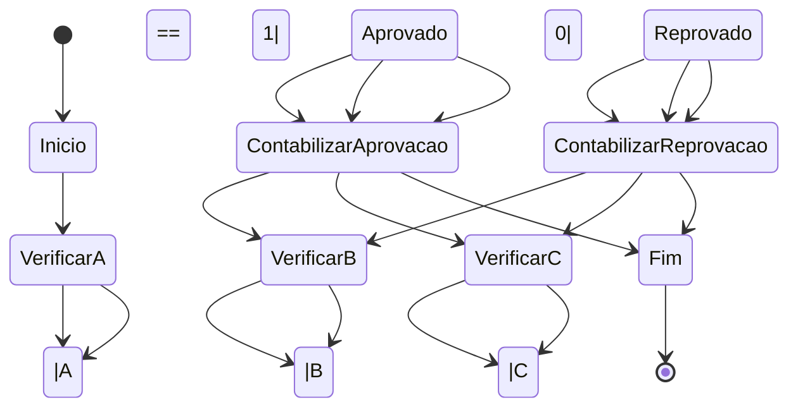

# Fluxograma do App

```mermaid
stateDiagram
    [*] --> Inicio
    Inicio --> VerificarA
    VerificarA --> |A == 1| Aprovado
    VerificarA --> |A == 0| Reprovado
    Aprovado --> ContabilizarAprovacao
    Reprovado --> ContabilizarReprovacao
    ContabilizarAprovacao --> VerificarB
    ContabilizarReprovacao --> VerificarB
    VerificarB --> |B == 1| Aprovado
    VerificarB --> |B == 0| Reprovado
    Aprovado --> ContabilizarAprovacao
    Reprovado --> ContabilizarReprovacao
    ContabilizarAprovacao --> VerificarC
    ContabilizarReprovacao --> VerificarC
    VerificarC --> |C == 1| Aprovado
    VerificarC --> |C == 0| Reprovado
    Aprovado --> ContabilizarAprovacao
    Reprovado --> ContabilizarReprovacao
    ContabilizarReprovacao --> Fim
    ContabilizarAprovacao --> Fim
    Fim --> [*]
```