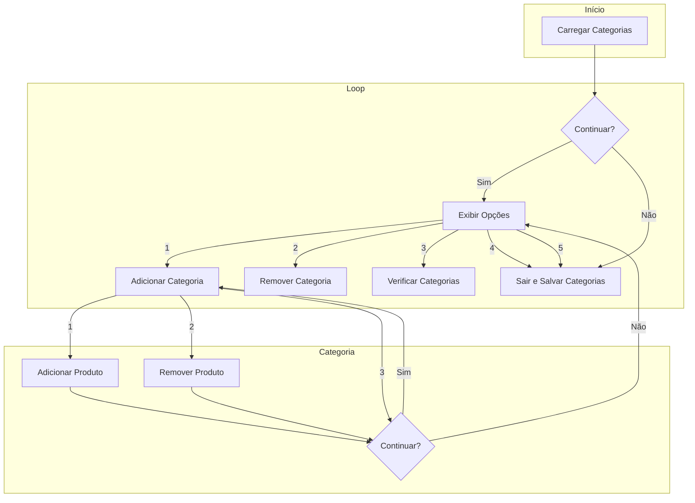

# Fluxograma do App

```mermaid
graph TD
    subgraph Início
    A[Carregar Categorias]
    end

    subgraph Loop
    B{Continuar?}
    C[Exibir Opções]
    D[Adicionar Categoria]
    E[Remover Categoria]
    F[Verificar Categorias]
    G[Sair e Salvar Categorias]
    B --> |Sim| C
    B --> |Não| G
    C --> |1| D
    C --> |2| E
    C --> |3| F
    C --> |4| G
    C --> |5| G
    end

    subgraph Categoria
    H[Adicionar Produto]
    I[Remover Produto]
    J{Continuar?}
    D --> |1| H
    D --> |2| I
    D --> |3| J
    H --> J
    I --> J
    J --> |Sim| D
    J --> |Não| C
    end

    A --> B
```