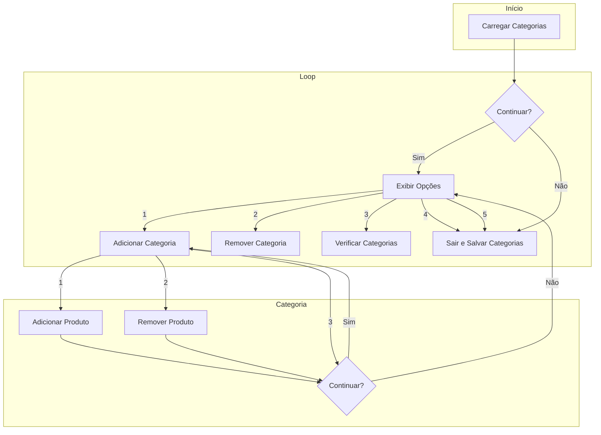

Uma empresa precisa desenvolver um sistema de gerenciamento de inventário para uma loja de animais de estimação. É designado alguém para resolver esse problema o relacionado à estrutura lógica da negativa universal onde "Nenhuma P é S", onde S representa uma categoria (por exemplo, animais) e P representa uma característica (por exemplo, plantas)..

Problema:
A empresa deseja criar um sistema que ajude a identificar quais produtos na loja são seguros para animais de estimação, levando em consideração que "Nenhum produto tóxico é seguro para animais de estimação." Deve-se desenvolver um componente do sistema que permita aos funcionários da loja categorizar produtos como "Seguro para Animais de Estimação" ou "Não Seguro para Animais de Estimação" com base em suas características (por exemplo, ingredientes, composição química, etc.). O programa deve usar a negativa universal (E) como estrutura lógica para expressar essa regra.

Um programa em C# que permite aos funcionários da loja inserir informações sobre os produtos, como nome, descrição, ingredientes, etc. O programa então aplica a regra "Nenhum produto tóxico é seguro para animais de estimação" para categorizar os produtos automaticamente. Os funcionários podem revisar e ajustar as categorizações conforme necessário.

Faremos um programa mais geral, utilizamos um dicionário (categorias) para armazenar as categorias como chaves e as listas de produtos como valores. As categorias são carregadas de um arquivo de texto quando o programa é iniciado e são salvas novamente quando o programa é encerrado. As opções fornecidas incluem a capacidade de exibir categorias, adicionar produtos a categorias, remover produtos de categorias, verificar categorias e sair do programa.

# Fluxograma do App

# Requisitos e Atualizações do Sistema

**Estrutura Inicial do Programa:**

Inicialmente, foi criada uma estrutura básica do programa em C# que incluiu a capacidade de adicionar, remover e verificar produtos em categorias relacionadas a animais.

**Introdução das Categorias de Animais:**

Foi adicionada a capacidade de adicionar e exibir categorias relacionadas a animais. O usuário podia escolher entre exibir categorias de animais, adicionar uma nova categoria de animal ou sair do programa.

**Transição para Categorias de Produtos mais Geral:**

Houve uma atualização significativa, transformando o sistema de categorias de animais em um sistema de categorias de produtos.
A estrutura lógica da Negativa Universal (E) foi mantida, mas agora aplicada a produtos em categorias.
O usuário pode gerenciar categorias de produtos, adicionar produtos a essas categorias e verificar os produtos existentes.

**Problemas com as Categorias Iniciais:**

Foi observado que as categorias iniciais não eram visíveis para o usuário.
Foi introduzida uma correção para mostrar as categorias já existentes antes de oferecer a opção de adicionar ou remover produtos.

**Adição e Remoção de Produtos nas Categorias:**

O programa permite, agora, ao usuário adicionar produtos a categorias existentes e remover produtos de categorias.
A adição de produtos só foi permitida após a adição de uma categoria.

**Persistência de Dados:**

Foi implementada a persistência de dados, permitindo que as categorias e produtos adicionados fossem salvos em um arquivo.

**Refatoração do Menu de Opções:**

O menu de opções foi aprimorado para fornecer opções mais claras e organizadas, incluindo a capacidade de adicionar ou remover produtos apenas após a adição de uma categoria.

**Exibição de Categorias e Produtos:**

O programa foi atualizado para exibir as categorias disponíveis e permitir ao usuário verificar os produtos dentro de uma categoria selecionada.

**Correção de Erros e Melhorias de Usabilidade:**

Foram corrigidos erros, como o manuseio de nomes de arquivo longos e problemas de sintaxe em condições MSBuild.
Foram introduzidas melhorias na usabilidade e na gestão de erros.

Essas são as atualizações em ordem cronológica, incluindo a transição do sistema de categorias de animais para um sistema mais geral de categorias de produtos. Cada atualização foi projetada para melhorar a funcionalidade e a usabilidade do programa, permitindo resolver o problema de forma eficaz de acordo com suas evoluções.