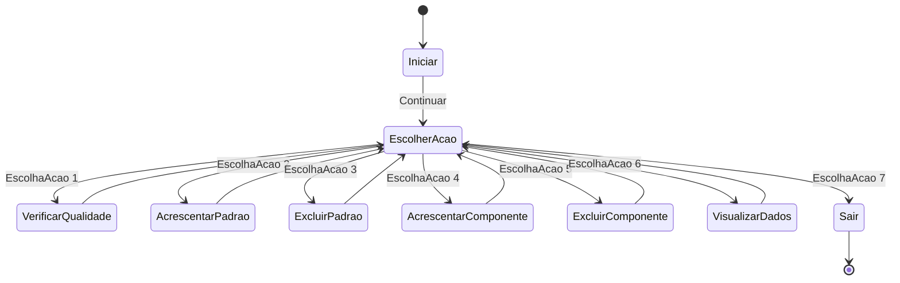

```mermaid
stateDiagram
    [*] --> Iniciar
    Iniciar --> EscolherAcao: Continuar
    EscolherAcao --> VerificarQualidade: EscolhaAcao 1
    EscolherAcao --> AcrescentarPadrao: EscolhaAcao 2
    EscolherAcao --> ExcluirPadrao: EscolhaAcao 3
    EscolherAcao --> AcrescentarComponente: EscolhaAcao 4
    EscolherAcao --> ExcluirComponente: EscolhaAcao 5
    EscolherAcao --> VisualizarDados: EscolhaAcao 6
    EscolherAcao --> Sair: EscolhaAcao 7
    VerificarQualidade --> EscolherAcao
    AcrescentarPadrao --> EscolherAcao
    ExcluirPadrao --> EscolherAcao
    AcrescentarComponente --> EscolherAcao
    ExcluirComponente --> EscolherAcao
    VisualizarDados --> EscolherAcao
    Sair --> [*]
```