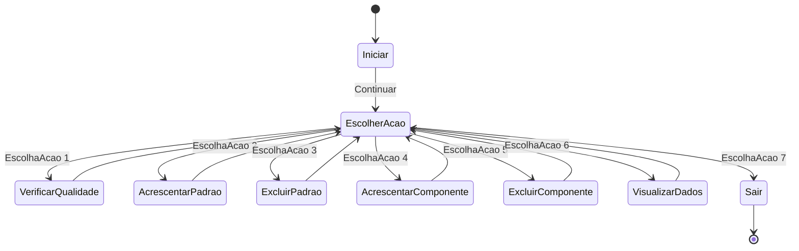

# Problema: Sistema de Qualidade

A TechX enfrenta um dilema crítico em sua cadeia de produção de dispositivos eletrônicos avançados. Eles precisam otimizar o controle de qualidade dos componentes eletrônicos que chegam à fábrica, garantindo que apenas componentes de alta qualidade sejam usados na produção final. Para isso, a empresa decidiu implementar um sistema de inspeção automatizada.

O desafio é projetar um sistema de inferência lógica que identifique componentes defeituosos com base em um conjunto de critérios de qualidade. O sistema deve seguir a estrutura lógica do Modus Ponens para tomar decisões precisas.

Estrutura Lógica do Problema:

Premissa A: Se um componente eletrônico não atender aos padrões de qualidade (A), ele é considerado defeituoso (B).

Premissa B: Um componente eletrônico não atende aos padrões de qualidade (A).

Conclusão: Portanto, o componente eletrônico é defeituoso (B).

Deve-se criar um programa que implemente essa estrutura lógica para tomar decisões automáticas sobre a qualidade dos componentes que chegam à fábrica. Os componentes defeituosos devem ser separados dos componentes de alta qualidade, economizando tempo e recursos da empresa.

Este desafio não apenas testará as habilidades de programação, mas também sua capacidade de aplicar a lógica aristotélica em um contexto do mundo real. A TechX está comprometida em fornecer treinamento e oportunidades emocionantes para pessoas talentas que desejam fazer a diferença na indústria de tecnologia.

Os programadores terão um prazo definido para resolver o problema e apresentar uma solução funcional. Aqueles que forem bem-sucedidos não apenas contribuirão para a eficiência da TechX, mas também terão a oportunidade de ingressar na equipe de desenvolvimento da empresa e continuar trabalhando em projetos inovadores.

Esse desafio emocionante destaca a importância da lógica e da programação no mundo empresarial moderno, onde a resolução de problemas lógicos pode levar a avanços significativos na eficiência operacional e na qualidade dos produtos.

## Atualizações no Programa:

**Primeira Iteração:**

- Implementação básica do programa com um **menu de ações.**
- **Carregamento de dados iniciais** de um arquivo JSON, se disponível.
- **Funcionalidade para adicionar** padrões de qualidade e componentes eletrônicos.
- **Funcionalidade para excluir** padrões de qualidade e componentes eletrônicos.
  
**Segunda Iteração:**

- Implementação da **funcionalidade para verificar a qualidade** de um componente eletrônico.
- Adição de uma **função para visualizar dados ativos**, incluindo padrões de qualidade e componentes eletrônicos.
  
**Terceira Iteração:**

- Implementação de **verificação de padrões de qualidade** para os componentes eletrônicos.
- **Armazenamento de dados ativos** em uma instância da classe Dados.
- **Serialização dos dados** para o formato JSON e **salvamento no arquivo** "dados.json" após cada ação.

**Quarta Iteração:**

- **Tratamento de exceções** para entradas inválidas do usuário.
- **Correção de erros de possível valor nulo** ao ler entradas do usuário.
- Uso de tipos anuláveis (string?) para **evitar problemas de valores nulos.**

**Quinta Iteração (Estado Final):**

- Refatoração do programa para **reduzir redundâncias.**
- **Simplificação do código,** removendo a necessidade de verificações de nulidade em muitos casos.
- **Melhorias na legibilidade do código** e organização das funcionalidades.

**Estado Final:**

O programa permite ao usuário realizar as seguintes ações: verificar a qualidade de um componente eletrônico, adicionar ou excluir padrões de qualidade, adicionar ou excluir componentes eletrônicos e visualizar dados ativos. Os dados são armazenados em um arquivo JSON chamado "dados.json" e são carregados e salvos automaticamente. O programa lida com entradas do usuário de maneira segura, evitando erros de valor nulo e tratando entradas inválidas.

Essas são as principais etapas da evolução do programa para resolver o problema inicial. Cada iteração adicionou funcionalidades e melhorou a estabilidade e a usabilidade do programa.

