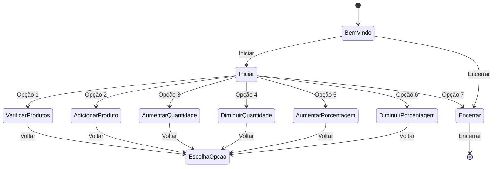

# Problema: Sistema de Verificação de Estoque

A empresa "TechShop" é uma loja online que vende produtos eletrônicos, como smartphones, laptops e acessórios. Eles possuem um grande estoque de produtos em seu armazém, e um dos desafios críticos que enfrentam é a verificação de estoque para garantir que todos os produtos listados em seu site estejam realmente disponíveis.

Para abordar esse problema, deve-se criar um Sistema de Verificação de Estoque baseado na estrutura lógica clássica "Todos os S são P" chamada de Afirmativa Universal (A). No caso desse contexto o S representará os produtos listados no site e P representará os produtos disponíveis no estoque. Em outras palavras, o sistema deve garantir que (S) todos os produtos listados no site estejam realmente disponíveis no (P) estoque. Abaixo estão os requisitos detalhados para o sistema:

## Requisitos do Sistema

1. **Entrada de Produtos do Site**:
   - O sistema deve receber uma lista de produtos disponíveis no site, representados por códigos ou nomes.

2. **Verificação de Disponibilidade no Estoque**:
   - O sistema deve verificar se todos os produtos da lista estão disponíveis no estoque da empresa(estão armazenados no programa). Isso requer a correspondência dos produtos listados com os registros de estoque da empresa(registros armazenados na memória).

3. **Relatório de Disponibilidade**:
   - Se todos os produtos estiverem disponíveis no estoque(na memória), o sistema deve gerar um relatório indicando "Todos os produtos que estão disponíveis no estoque(na memória de registro)".

4. **Identificação de Produtos em Falta**:
   - Se algum dos produtos não estiver disponível no estoque(na memória de registro), o sistema deve identificar quais produtos estão em falta e gerar um relatório indicando quais produtos não estão disponíveis.

5. **Interface Interativa**:
   - O sistema deve ser interativo, permitindo que o usuário insira a lista de produtos a serem verificados de forma amigável.

6. **Eficiência de Processamento**:
   - É essencial garantir que o sistema seja eficiente e capaz de lidar com grandes volumes de produtos para garantir um desempenho ideal.

Esse desafio exige a criação de um sistema robusto que assegure a integridade das informações de estoque, utilizando a estrutura lógica "Todos os S são P". A implementação bem-sucedida deste sistema ajudará a empresa a manter a precisão de seu comércio eletrônico e a melhorar a experiência do cliente.

## Funcionamento do App (Solução):

## Atualizações do Programa:

**Atualização 1:** Foi criada a estrutura básica do programa que permitia a verificação de produtos disponíveis. Não havia suporte para adicionar, modificar ou salvar produtos.

**Atualização 2:** Adição da funcionalidade de adicionar produtos ao estoque. Os produtos agora podiam ser inseridos manualmente pelo usuário.

**Atualização 3:** A funcionalidade de aumentar a quantidade de um produto no estoque foi adicionada, permitindo que os usuários aumentassem a quantidade disponível de um produto existente.

**Atualização 4:** Foi implementada a capacidade de diminuir a quantidade de um produto no estoque, garantindo que as quantidades não fiquem negativas.

**Atualização 5:** Foram adicionadas opções para aumentar e diminuir a porcentagem do valor de um produto, permitindo ajustar os preços.

**Atualização 6:** Adição de funcionalidade para fazer backup automático do arquivo "estoque.json" antes de qualquer modificação nos dados do estoque.

**Atualização 7:** O programa agora permite que o usuário veja apenas os produtos disponíveis no estoque e adicionou a opção de verificar as características dos produtos que estão no estoque.

**Atualização 8:** Foi adicionada a opção de aumentar a quantidade de produtos já cadastrados no estoque.

**Atualização 9:** Adição da opção de diminuir a quantidade de produtos já cadastrados no estoque.

**Atualização 10:** A formatação dos valores monetários foi corrigida para exibir valores a partir de milhares corretamente.

**Atualização 11:** Implementação de salvamento automático de produtos cadastrados para uma próxima abertura do programa.

**Atualização 12:** Adição de tratamento de exceção para lidar com erros de JSON ao carregar o arquivo de estoque.

**Atualização 13:** Adição das opções de aumentar e diminuir a porcentagem do valor de um produto existente no estoque.

Com essas atualizações, o programa evoluiu de uma simples verificação de produtos em estoque para um sistema mais completo de gerenciamento de estoque, permitindo adicionar, modificar, salvar e fazer backup dos dados de estoque, além de fornecer informações detalhadas sobre produtos disponíveis.