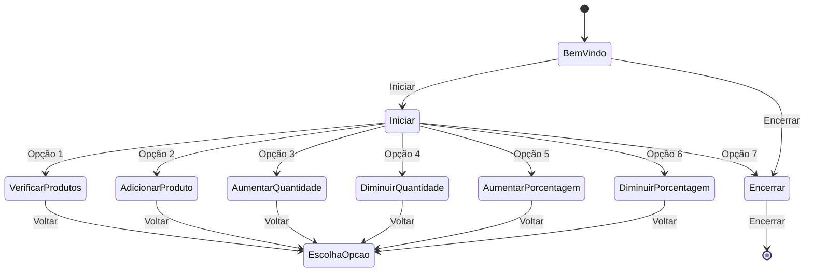

# Problema Imaginário: Sistema de Verificação de Estoque

A empresa fictícia "TechShop" enfrenta o desafio crítico de garantir a precisão do estoque em seu comércio eletrônico. Para abordar esse problema, o trainee em programação deve criar um Sistema de Verificação de Estoque baseado na estrutura lógica "Todos os S são P", onde S representa produtos listados no site e P representa produtos disponíveis no estoque. Abaixo estão os requisitos detalhados para o sistema:

## Requisitos do Sistema

1. **Entrada de Produtos do Site**:
   - O sistema deve receber uma lista de produtos disponíveis no site, representados por códigos ou nomes.

2. **Verificação de Disponibilidade no Estoque**:
   - O sistema deve verificar se todos os produtos da lista estão disponíveis no estoque da empresa. Isso requer a correspondência dos produtos listados com os registros de estoque da empresa.

3. **Relatório de Disponibilidade**:
   - Se todos os produtos estiverem disponíveis no estoque, o sistema deve gerar um relatório indicando que "Todos os produtos estão disponíveis no estoque".

4. **Identificação de Produtos em Falta**:
   - Se algum dos produtos não estiver disponível no estoque, o sistema deve identificar quais produtos estão em falta e gerar um relatório indicando quais produtos não estão disponíveis.

5. **Interface Interativa**:
   - O sistema deve ser interativo, permitindo que o usuário insira a lista de produtos a serem verificados de forma amigável.

6. **Eficiência de Processamento**:
   - É essencial garantir que o sistema seja eficiente e capaz de lidar com grandes volumes de produtos para garantir um desempenho ideal.

Esse desafio fictício da empresa "TechShop" exige que o trainee em programação crie um sistema robusto que assegure a integridade das informações de estoque, utilizando a estrutura lógica "Todos os S são P". A implementação bem-sucedida deste sistema ajudará a empresa a manter a precisão de seu comércio eletrônico e a melhorar a experiência do cliente.

# Funcionamento do App

