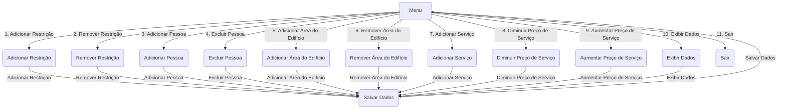

# Sistema de Controle de Acesso a Edifícios Inteligentes

Uma empresa que desenvolve sistemas de controle de acesso a edifícios inteligentes contratou um programador para melhorar seu software. O software atual permite que os usuários definam negativas particulares para restringir o acesso de certas categorias de pessoas a áreas específicas do edifício.

**A missão do programador** é aprimorar a interface do usuário do software de controle de acesso. O objetivo é permitir que os administradores do edifício escolham facilmente categorias (S) de pessoas e categorias (P) de áreas do edifício e, em seguida, o software gerará a negativa particular correspondente para restringir o acesso.

**O programa deve permitir aos administradores:**

- Escolher categorias de pessoas (S) e áreas do edifício (P).
- Gerar negativas particulares com base nas escolhas feitas.
- Continuar adicionando restrições ou sair do programa quando desejarem.
- 
Essa missão requer que a aplicação de conhecimentos de programação para criar uma interface amigável e eficiente, além de entender e implementar a lógica aristotélica de negativas particulares para garantir que o controle de acesso seja configurado de acordo com as necessidades da empresa.

# Fluxograma do App

## Atualizações no Programa (em ordem cronológica):

- **Implementou a estrutura básica do programa** para permitir que os administradores escolham categorias (S) e (P) e gerem negativas particulares.

- Adicionou **funcionalidade para continuar adicionando restrições** ou sair do programa.
  
- Incluiu a **capacidade de adicionar e remover áreas** do edifício.

- Permitiu aos administradores **adicionar e excluir pessoas (clientes) cadastradas.**

- Implementou a **adição e remoção de serviços**, bem como a **alteração de preços de serviços em porcentagem.**

- Adicionou a funcionalidade de **salvar os dados automaticamente** após cada operação.

- Introduziu a capacidade de **exibir os dados atuais no sistema.**

- Atualizou o programa para incluir a **opção de aumentar o preço do serviço em uma porcentagem especificada.**

O programa foi desenvolvido incrementalmente para atender a todos os requisitos e funcionalidades solicitados, tornando-o robusto e prático para uso dos administradores. Cada etapa da implementação construiu sobre a anterior, resultando no estado final do programa que é capaz de lidar com todas as operações necessárias no contexto do Sistema de Controle de Acesso a Edifícios Inteligentes.