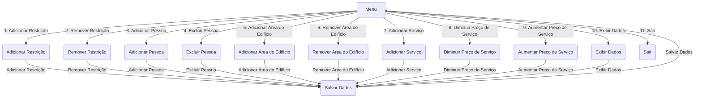

# Fluxograma do App

```mermaid
graph TD
  A[Menu] -->|1. Adicionar Restrição| B(Adicionar Restrição)
  A -->|2. Remover Restrição| C(Remover Restrição)
  A -->|3. Adicionar Pessoa| D(Adicionar Pessoa)
  A -->|4. Excluir Pessoa| E(Excluir Pessoa)
  A -->|5. Adicionar Área do Edifício| F(Adicionar Área do Edifício)
  A -->|6. Remover Área do Edifício| G(Remover Área do Edifício)
  A -->|7. Adicionar Serviço| H(Adicionar Serviço)
  A -->|8. Diminuir Preço de Serviço| I(Diminuir Preço de Serviço)
  A -->|9. Aumentar Preço de Serviço| J(Aumentar Preço de Serviço)
  A -->|10. Exibir Dados| K(Exibir Dados)
  A -->|11. Sair| L(Sair)
  B -->|Adicionar Restrição| Z(Salvar Dados)
  C -->|Remover Restrição| Z
  D -->|Adicionar Pessoa| Z
  E -->|Excluir Pessoa| Z
  F -->|Adicionar Área do Edifício| Z
  G -->|Remover Área do Edifício| Z
  H -->|Adicionar Serviço| Z
  I -->|Diminuir Preço de Serviço| Z
  J -->|Aumentar Preço de Serviço| Z
  K -->|Exibir Dados| Z
  Z -->|Salvar Dados| A
```