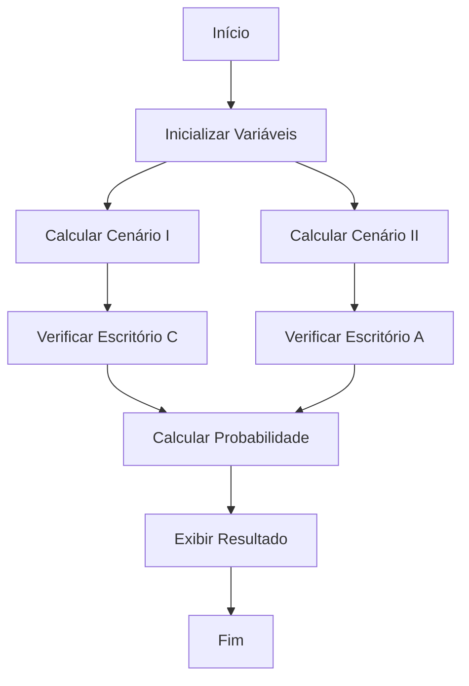

# Fluxograma do App

```mermaid
graph TD
    A[Início] --> B[Inicializar Variáveis]
    B --> C[Calcular Cenário I]
    B --> D[Calcular Cenário II]
    C --> E[Verificar Escritório C]
    D --> F[Verificar Escritório A]
    E --> G[Calcular Probabilidade]
    F --> G
    G --> H[Exibir Resultado]
    H --> I[Fim]
```